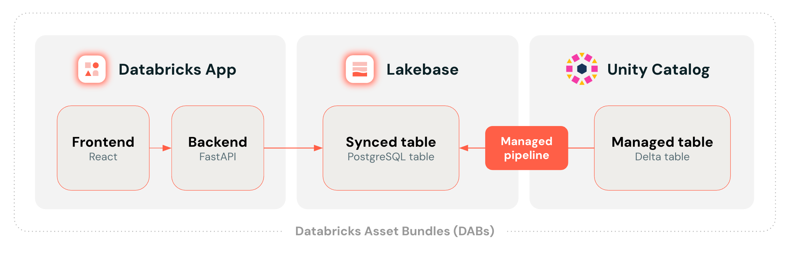

# Databricks App: React + Lakebase + Synced Table

This repository demonstrates how to deploy a [Databricks App](https://docs.databricks.com/aws/en/dev-tools/databricks-apps/), [Lakebase](https://www.databricks.com/product/lakebase) OLTP database, and [synced table](https://docs.databricks.com/aws/en/oltp/instances/sync-data/sync-table) in a [Databricks Asset Bundles (DABs)](https://docs.databricks.com/aws/en/dev-tools/bundles/) bundle.

## Features

- App frontend based on [React](https://react.dev/), [Vite](https://vite.dev/), [TypeScript](https://www.typescriptlang.org/), and [TailwindCSS](https://tailwindcss.com/) for styling
- App backend based on [FastAPI](https://fastapi.tiangolo.com/), [uvicorn](https://www.uvicorn.org/), and [psycopg](https://psycopg.org/)
- Interactive charts and data tables based on [AG Grid](https://ag-grid.com/) and [AG Charts](https://charts.ag-grid.com/).
- Low-latency queries from a [Lakebase](https://www.databricks.com/product/lakebase) PostgreSQL table.
- Managed data synchronization from Delta table to Lakebase using [synced tables](https://docs.databricks.com/aws/en/oltp/instances/sync-data/sync-table).
- [Databricks SDK](https://databricks-sdk-py.readthedocs.io/) for secure OAuth 2.0 based auth with Lakebase.
- Seamless deployment using [Databricks Asset Bundles (DABs)](https://docs.databricks.com/en/dev-tools/bundles/index.html).

## Architecture



## Project Structure

```
├── app/                        # Main application directory
│   ├── main.py                 # FastAPI application entry point
│   ├── models.py               # Database models and data structures
│   ├── database.py             # Database connection and configuration
│   ├── app.yaml                # Databricks Apps configuration
│   ├── pyproject.toml          # Python dependencies
│   └── frontend/               # React frontend application
├── resources/                  # DAB resources
│   ├── app.yml                 # App resource configuration
│   └── database.yml            # Database resource configuration
└── databricks.yml              # DAB bundle configuration
```

## Prerequisites

- [Databricks CLI](https://github.com/databricks/cli) v0.269.0+
- [psql](https://www.postgresql.org/docs/16/app-psql.html)
- Python 3.9+
- Node.js 18+

## Setup

### 1. Create sample data

Create a source Delta table with a unique primary key:

```sql
CREATE TABLE main.default.trips AS
SELECT
  ROW_NUMBER() OVER (ORDER BY tpep_pickup_datetime) AS id,
  *
FROM
  samples.nyctaxi.trips
```

If you deviate from using the `main` catalog and `default` schema, make sure to provide these variables when deploying the bundle in the next step.

### 2. Deploy to Databricks

In `databricks.yml`, adjust the workspace host URL for the `dev` and `staging` environments. Add more environments as needed.

If you adjusted the schema name, make sure to also update `resources/app.yml` with the schema name:

```yaml
[...]

env:
  - name: PGSCHEMA
    value: "my-schema-name"
```

Build the frontend:

```bash
cd app/frontend && npm install && npm run build
```

Deploy the bundle:

```bash
databricks bundle deploy -t dev -p my-profile
```

> [!NOTE]
> "dev" is the default target, so the `-t` parameter is optional here.

To use a custom catalog and schema:

```bash
databricks bundle deploy --var="catalog=my_catalog,schema=my_schema" -t dev -p my-profile
```

See the [DABs documentation](https://docs.databricks.com/aws/en/dev-tools/bundles/variables#set-a-variables-value) for alternative ways to override these variables.

After deployment, the Databricks Apps resource is created but remains in a stopped state.

Start the app:

```bash
databricks bundle run app -t dev -p my-profile
```

### 3. Grant database permissions

Get your app's service principal ID:

```bash
databricks apps get trips-app -t dev -p my-profile
```

The id should look similar to the following:

```json
{
  ...
  "service_principal_client_id": "c6dcbe3f-a587-4f6c-aa2f-4e33220b896d",
  ...
}
```

Assign the necessary permissions to the service principal by running a query on your Lakebase instance:

```bash
databricks -p my-profile psql trips-app-instance -- -d trips-app-database -c "
BEGIN;
GRANT USAGE ON SCHEMA default TO \"<service_principal_client_id>\";
GRANT SELECT ON default.trips_synced TO \"<service_principal_client_id>\";
COMMIT;
"
```

> [!NOTE]  
> psql command line needs to be installed on your local machine. psql is installed when you install postgresql. Alternatively, install libpq to install psql without a full postgresql setup (MacOS, Linux) or select only the command line tools when installing PostgreSQL using the official installer (Windows).

## Run Locally

### Backend

Create `.env` in the `app` folder:

```
PGHOST=instance-id.database.cloud.databricks.com
PGDATABASE=trips-app-database
PGSCHEMA=my-schema-name # optionally adjust if not using "default" schema
DATABRICKS_PROFILE=e2-demo-emea # optionally adjust if not using default profile
```

These environment variables are set automatically in the deployed Databricks Apps environment or in `app.yml`.

Run the backend:

```bash
cd app
uv run --env-file .env uvicorn main:app --reload
```

Access at:

- Frontend: http://127.0.0.1:8000/
- API: http://127.0.0.1:8000/api/

However, the frontend served by FastAPI uses the `app/frontend/dist` folder which contains the transpiled React application. This frontend is not hot-reloaded and does not reflect changes you make to the React code. Instead, run the frontend in a separate process as explained in the following section.

### Frontend

For hot reloading during development:

```bash
cd app/frontend
npm install
npm run dev
```

Build for production:

```bash
cd app/frontend
npm run build
```

This outputs the transpiled static files to `app/frontend/dist/`.

## How to get help

Databricks Support doesn't cover this content. For questions or bugs, please open a GitHub issue and the team will help on a best effort basis.
